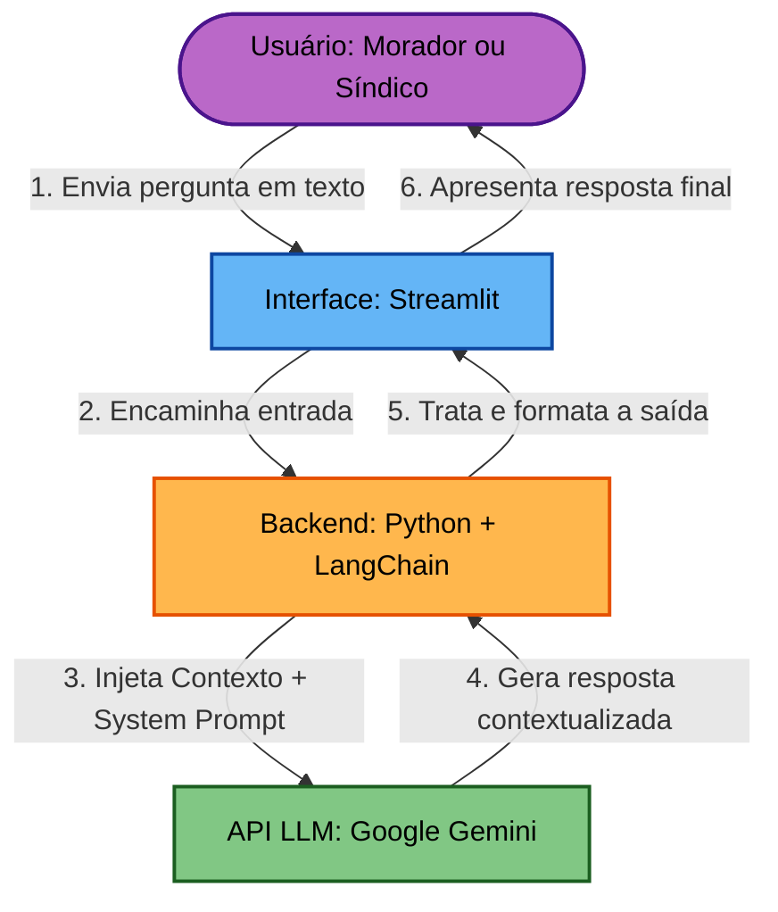
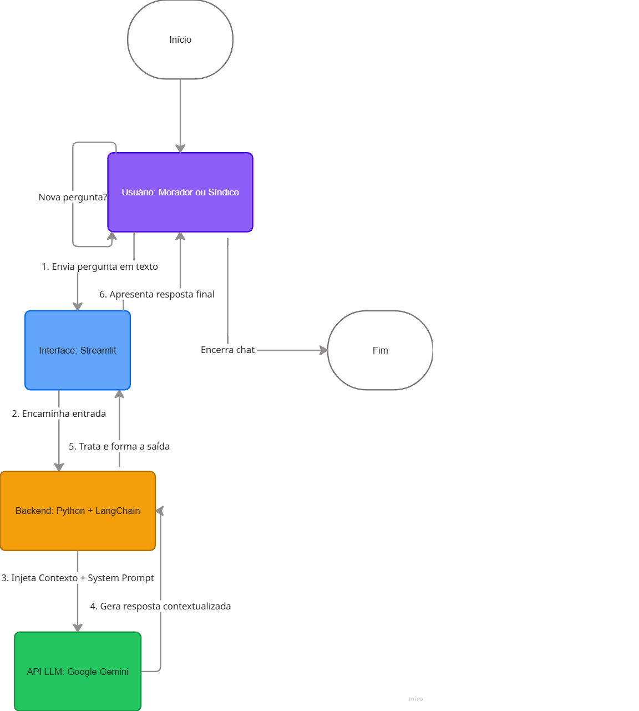

# GoodWe ChargeOps Assistant — EV Challenge 2026

## Integrantes
*   **Nickollas Korner** - RM: 569655
*   **João Pedro Ferrari** - RM: 573037
*   **Lucas Santana** - RM: 573197
*   **Lucca Bracco** - RM: 570175
*   **Vitor Nascimento** - RM: 571873
*   **Pierri Biason** - RM: 569718
---

## 1. O Problema Abordado
Com a rápida expansão dos veículos elétricos (EVs), os condomínios residenciais enfrentam um severo gargalo logístico e infraestrutural. A ausência de mecanismos integrados para gerenciar o uso compartilhado de eletropostos gera três dores centrais:
1.  **Disputa por Espaço e Tempo:** Moradores sobrecarregam os carregadores nos mesmos horários (geralmente ao retornar do trabalho), gerando conflitos de convivência.
2.  **Injustiça Financeira:** Dificuldade do síndico em calcular e ratear o consumo exato de energia de cada veículo, resultando em cobranças genéricas e injustas na taxa condominial fixa.
3.  **Sobrecarga da Rede Elétrica:** Risco iminente de queda do disjuntor geral do condomínio caso múltiplos carregadores operem em potência máxima simultaneamente.

---

## 2. Proposta do Chatbot (Escopo e Persona)
O **GoodWe ChargeOps Assistant** é um chatbot com IA especializado no ecossistema condominial da GoodWe. Ele atua como um mediador inteligente operando em duas frentes de atendimento (Persona Dupla):

*   **Para o Morador (Concierge de Recarga):** Permite realizar e consultar agendamentos de horários, checar a disponibilidade da vaga em tempo real, consultar o histórico de consumo pessoal em kWh e receber alertas sobre o fim do ciclo de recarga.
*   **Para o Síndico (Painel Operacional):** Funciona como um assistente de gestão em linguagem natural, auxiliando no fechamento de relatórios de faturamento mensais, monitoramento dos ciclos de uso e aplicação de regras de agendamento do condomínio.

---

## 3. Arquitetura e Justificativa Técnica

Para garantir a viabilidade comercial, robustez e agilidade no desenvolvimento, a solução foi desenhada utilizando a seguinte stack tecnológica:

| Tecnologia | Função no Projeto | Justificativa Técnica |
| :--- | :--- | :--- |
| **Python** | Linguagem Principal | Linguagem base obrigatória devido à sua maturidade, versatilidade e vasta gama de bibliotecas voltadas para Inteligência Artificial. |
| **Streamlit** | Interface do Usuário (Front-end) | Framework que transforma scripts Python em aplicações web interativas rapidamente, permitindo criar um chat limpo e intuitivo focado na experiência do usuário. |
| **LangChain** | Orquestração e Memória | Essencial para gerenciar o contexto e o histórico das conversas, garantindo que o chatbot se lembre de mensagens anteriores durante o fluxo de agendamento. |
| **Google Gemini API** | Modelo de Linguagem (LLM) | Uso do modelo `gemini-1.5-flash` devido ao seu tempo de resposta ultra-rápido, excelente compreensão de contexto (NLP) e custo por token extremamente baixo para produção. |

---

## 4. Fluxograma de Funcionamento
O fluxo lógico do sistema consiste nas seguintes etapas:

> **Fluxograma Visual do Sistema:**
> 

---

## 5. Contexto-Base (System Prompt)
A IA é condicionada através de diretrizes estritas de comportamento operando sob regras de negócio específicas para o ecossistema `EV ChargeOps` (blocos de recarga de até 4 hours, modo de potência reduzida em horários de pico entre 18h e 21h, e travas de privacidade em conformidade com a LGPD).
> *O documento de instrução completo pode ser consultado em:* `system_prompt.txt`

---

## 6. Matriz de Testes
Para garantir a qualidade das respostas na próxima sprint, foi desenvolvida uma matriz de validação contendo cenários de teste reais para moradores, síndicos e situações de suporte técnico.
> *A tabela com as 5 perguntas e respostas ideais esperadas está disponível em:* `modelo_teste.md`

---

## Próximos Passos (Estrutura da Sprint)
*   [x] Configuração da Infraestrutura Base e Ambiente (`.env.example` / `.gitignore` / `requirements.txt`)
*   [x] Definição de Escopo, Personas e Justificativa Técnica (`README.md`)
*   [x] Inclusão do arquivo visual do Fluxograma de Funcionamento
*   [x] Vinculação do arquivo de System Prompt (`system_prompt.txt`)
*   [x] Vinculação da Matriz com o Modelo de Testes (`modelo_teste.md`)
