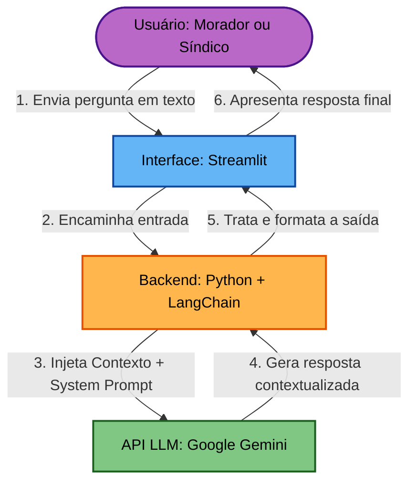
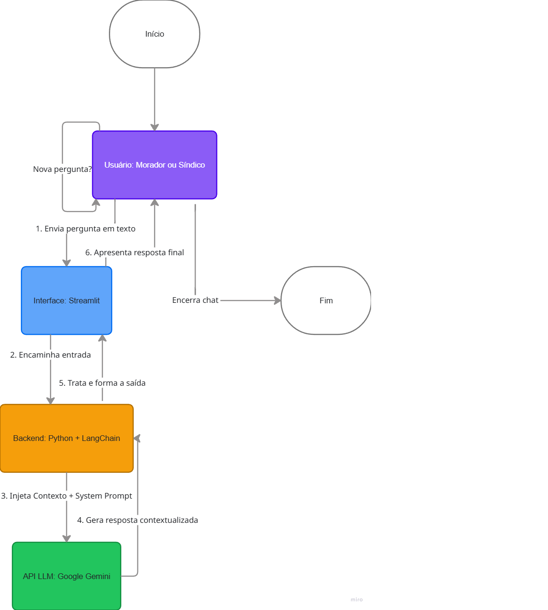

# GoodWe ChargeOps Assistant — EV Challenge 2026

## Integrantes
*   **Nickollas Korner** - RM: 569655
*   **João Pedro Ferrari** - RM: 573037
*   **Lucas Santana** - RM: 573197
*   **Lucca Bracco** - RM: 570175
*   **Vitor Nascimento** - RM: 571873
*   **Pierri Biason** - RM: 569718
---

## 1. O Problema Abordado
Com a rápida expansão dos veículos elétricos (EVs), os condomínios residenciais enfrentam um severo gargalo logístico e infraestrutural. A ausência de mecanismos integrados para gerenciar o uso compartilhado de eletropostos gera três dores centrais:
1. **Disputa por Espaço e Tempo:** Moradores sobrecarregam os carregadores nos mesmos horários (geralmente ao retornar do trabalho), gerando conflitos de convivência.
2. **Injustiça Financeira:** Dificuldade do síndico em calcular e ratear o consumo exato de energia de cada veículo, resultando em cobranças genéricas e injustas na taxa condominial fixa.
3. **Sobrecarga da Rede Elétrica:** Risco iminente de queda do disjuntor geral do condomínio caso múltiplos carregadores operem em potência máxima simultaneamente.

---

## 2. Proposta da Solução (Persona Dupla & Guardrails)
O **GoodWe ChargeOps Agent** é um agente inteligente de conversação especializado no ecossistema condominial da GoodWe. Ele atua como um mediador operando em duas frentes de atendimento:

* **Para o Morador (Concierge de Recarga):** Permite realizar e consultar agendamentos de horários, checar a disponibilidade da vaga em tempo real, consultar o histórico de consumo pessoal em kWh e receber alertas sobre o fim do ciclo de recarga.
* **Para o Síndico (Painel Operacional):** Funciona como um assistente de gestão em linguagem natural, auxiliando no fechamento de relatórios de faturamento mensais, monitoramento dos ciclos de uso e aplicação de regras de agendamento do condomínio.

### Guardrails & Segurança (Sprint 03)
Na Sprint 03, foram incorporadas diretrizes severas de segurança diretamente no orquestrador:
* **Resistência a Prompt Injection:** O agente recusa categoricamente ordens para ignorar suas instruções de sistema.
* **Foco Estrito de Escopo:** Recusa responder perguntas não relacionadas a eletropostos GoodWe.
* **Travas de Responsabilidade:** Não emite pareceres jurídicos, financeiros ou orientações de manipulação elétrica de alta tensão que ofereçam risco.

---

## 3. Arquitetura Técnica & Evolução (Sprint 03)

Nesta etapa, o sistema evoluiu de uma chamada manual de API para um **Agente Orquestrado via LangChain**, com gerenciamento declarativo de memória por sessão e seleção dinâmica de modelos:

| Tecnologia | Função no Projeto | Justificativa Técnica |
| :--- | :--- | :--- |
| **Python 3.11+** | Linguagem Principal | Linguagem base obrigatória pela maturidade e amplo suporte a bibliotecas de Inteligência Artificial. |
| **Streamlit** | Interface Interativa (Front-end) | Interface reativa em tempo real com suporte a controle de hiperparâmetros (Temperature/Top P) e gerenciamento visual de sessões. |
| **LangChain Framework** | Orquestração do Agente | Responsável por unir o `ChatPromptTemplate`, o gerenciador de memória `InMemoryChatMessageHistory` e o executor `RunnableWithMessageHistory`. |
| **Google Gemini API** | Motor LLM Multimodelo | Suporte dinâmico aos modelos `gemini-2.5-flash` e `gemini-2.5-pro`, unindo baixíssima latência, capacidade de raciocínio e conformidade com os Guardrails. |

---

## 4. Fluxograma de Funcionamento
O fluxo lógico do sistema consiste nas seguintes etapas:

```mermaid
graph TD
    %% Estilos de nós corrigidos com texto escuro para alto contraste
    classDef usuario fill:#BA68C8,stroke:#4A148C,stroke-width:2px,color:#000000;
    classDef front fill:#64B5F6,stroke:#0D47A1,stroke-width:2px,color:#000000;
    classDef back fill:#FFB74D,stroke:#E65100,stroke-width:2px,color:#000000;
    classDef ai fill:#81C784,stroke:#1B5E20,stroke-width:2px,color:#000000;

    %% Fluxo Principal
    U([Usuário: Morador ou Síndico]) -->|1. Envia pergunta em texto| ST[Interface: Streamlit]
    ST -->|2. Encaminha entrada| PY[Backend: Python + LangChain]
    
    %% Processamento da IA
    PY -->|3. Injeta Contexto + System Prompt| GM[API LLM: Google Gemini]
    GM -->|4. Gera resposta contextualizada| PY
    
    %% Retorno do Fluxo
    PY -->|5. Trata e formata a saída| ST
    ST -->|6. Apresenta resposta final| U

    %% Aplicação dos Estilos
    class U usuario;
    class ST front;
    class PY back;
    class GM ai;
```

> **Fluxograma Visual do Sistema:**
> 

---

## 5. Experimentos e Comparação de Modelos (LLM)
Para atender aos requisitos de avaliação de desempenho da Sprint 03, foram realizados testes comparativos entre os modelos atualizados da série 2.5 da Google com hiperparâmetros padronizados (temperature=0.7, top_p=0.95):

Gemini 2.5 Flash: Modelo escolhido como padrão da aplicação. Apresentou latência média baixíssima (~0.8s), adesão perfeita aos Guardrails e excelente custo-benefício.

Gemini 2.5 Pro: Apresentou respostas mais detalhadas em cenários complexos de infraestrutura, porém com latência um pouco maior (~1.2s).

A documentação completa do benchmark pode ser consultada no arquivo: relatorio_modelos.md

---

## 6. Documentações & Anexos do Projeto
Instruções de Sistema e Guardrails: config/system_prompt.txt

Matriz de Testes (Funcionais, Memória & Segurança): modelo_teste.md

Relatório de Comparação de LLMs: relatorio_modelos.md

Relatório Oficial de Evolução (PDF): Relatorio-Evolucao-Sprint-Prompt-and-Artificial-Inteligence.pdf

Lista da Equipe: integrantes.txt

---

## 7. Como Executar o Projeto Localmente
* Clone o repositório: **git clone https://github.com/Nickollas09/Sprint-Prompt-and-Artificial-Intelligence.git**

* Instale as dependências atualizadas: **py -m pip install -r requirements.txt**

* Configure a Chave de API: Crie um arquivo .env na raiz do projeto contendo a sua chave do Google AI Studio: **GEMINI_API_KEY=sua_chave_aqui**

* Inicie a aplicação com o LangChain: **py -m streamlit run app.py**